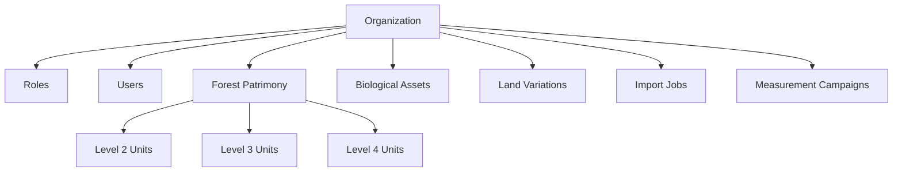

## Overview

SMyEG implements a sophisticated multi-organization architecture that enables complete data isolation while allowing users to access multiple organizations. The system supports organization switching and ensures data security through organization-scoped queries.

## Organization Model

The organization entity serves as the top-level container for all application data:

```prisma
model Organization {
  id                         String                       @id @default(uuid())
  name                       String
  slug                       String                       @unique
  description                String?
  logoUrl                    String?
  countryId                  String?
  website                    String?
  isActive                   Boolean                      @default(true)
  settings                   Json?
  
  // Relationships to all major entities
  roles                      Role[]
  users                      User[]
  forestPatrimonyLevel2Units ForestPatrimonyLevel2[]
  landPatrimonialVariations  LandPatrimonialVariation[]
  assetMeasurementCampaigns  AssetMeasurementCampaign[]
  // ... and many more
}
```

## Data Isolation Strategy

### Organization-Scoped Entities

Most entities in the system include an `organizationId` foreign key:

```prisma
model ForestPatrimonyLevel2 {
  id              String        @id @default(uuid())
  organizationId  String?
  organization    Organization? @relation(fields: [organizationId], references: [id])
  // ... other fields
}

model AssetMeasurementCampaign {
  id              String        @id @default(uuid())
  organizationId  String
  organization    Organization  @relation(fields: [organizationId], references: [id])
  // ... other fields
}
```

### Query Filtering

All queries must filter by organization to ensure data isolation:

```typescript
// Always include organizationId in queries
const campaigns = await prisma.assetMeasurementCampaign.findMany({
  where: {
    organizationId: session.user.organizationId,
    // ... other filters
  }
});
```

<Warning>
  **Critical**: Never query entities without filtering by `organizationId` in production code. This could lead to data leakage across organizations.
</Warning>

## User Organization Access

### Authorization Model

Users can have access to multiple organizations through two mechanisms:

1. **Super Admin Role**: Access to all active organizations
2. **Role Assignments**: Access through organization-specific role assignments

### Getting Authorized Organizations

The `getAuthorizedOrganizationsForUser` function in `src/lib/auth-organizations.ts` determines which organizations a user can access:

```typescript
export async function getAuthorizedOrganizationsForUser(
  userId: string, 
  fallbackOrganizationId?: string | null
) {
  // Check for Super Admin role
  const hasSuperAdminRole = await prisma.userRole.findFirst({
    where: {
      userId,
      isActive: true,
      role: {
        isActive: true,
        slug: "SUPER_ADMIN"
      }
    }
  });

  if (hasSuperAdminRole) {
    // Return all active organizations
    return await prisma.organization.findMany({
      where: {
        isActive: true,
        deletedAt: null
      },
      orderBy: { name: "asc" },
      select: { id: true, name: true }
    });
  }

  // Find organizations through role assignments
  const assignments = await prisma.userRole.findMany({
    where: {
      userId,
      isActive: true,
      role: {
        isActive: true,
        organizationId: { not: null },
        organization: {
          isActive: true,
          deletedAt: null
        }
      }
    },
    select: {
      role: {
        select: {
          organization: {
            select: { id: true, name: true }
          }
        }
      }
    }
  });

  // Extract and deduplicate organizations
  const organizations = assignments
    .map(assignment => assignment.role.organization)
    .filter((org): org is { id: string; name: string } => Boolean(org));

  // Add fallback organization if provided
  if (fallbackOrganizationId) {
    const fallbackOrg = await prisma.organization.findFirst({
      where: { id: fallbackOrganizationId, isActive: true, deletedAt: null },
      select: { id: true, name: true }
    });
    if (fallbackOrg) organizations.push(fallbackOrg);
  }

  // Deduplicate and sort
  const deduped = new Map<string, AuthorizedOrganization>();
  for (const org of organizations) {
    deduped.set(org.id, org);
  }

  return Array.from(deduped.values()).sort((a, b) => 
    a.name.localeCompare(b.name)
  );
}
```

## Organization Selection Flow

<Steps>
  <Step title="Login Page">
    User enters credentials (email/username and password)
  </Step>
  
  <Step title="Organization Lookup">
    System retrieves all organizations the user can access using `getAuthorizedOrganizationsForUser`
  </Step>
  
  <Step title="Organization Selection">
    If user has access to multiple organizations, they select which one to access
  </Step>
  
  <Step title="Session Creation">
    Session is created with the selected `organizationId` and `organizationName`
  </Step>
  
  <Step title="Context Enforcement">
    All subsequent API calls are scoped to the selected organization
  </Step>
</Steps>

## Organization Switching

### Session Context

The current organization is stored in the user session:

```typescript
type SessionUser = {
  id: string;
  email: string;
  roles: string[];
  permissions: string[];
  organizationId: string | null;
  organizationName: string | null;
};
```

### Switching Organizations

To switch organizations, users must:
1. Sign out of the current session
2. Sign in again and select a different organization

<Info>
  Future enhancement: Implement seamless organization switching without full re-authentication by updating the session token.
</Info>

## Organization Cards

For enhanced UX, the system provides organization cards with logos and custom titles:

```typescript
export type AuthorizedOrganizationCard = {
  id: string;
  name: string;
  logoUrl: string | null;
  siteTitle: string | null;
};

export async function getAuthorizedOrganizationCards(
  userId: string, 
  fallbackOrganizationId?: string | null
) {
  const authorizedOrganizations = await getAuthorizedOrganizationsForUser(
    userId, 
    fallbackOrganizationId
  );
  const organizationIds = authorizedOrganizations.map(org => org.id);

  const organizations = await prisma.organization.findMany({
    where: { id: { in: organizationIds }, isActive: true, deletedAt: null },
    select: { id: true, name: true, logoUrl: true }
  });

  // Fetch custom site titles from SystemConfiguration
  const siteTitleConfigs = await prisma.systemConfiguration.findMany({
    where: {
      organizationId: { in: organizationIds },
      category: "general",
      key: { in: ["site_title", "site_name"] }
    }
  });

  // Map site titles to organizations
  // ...
}
```

## System Configuration

Organizations can have custom configurations:

```prisma
model SystemConfiguration {
  id              String        @id @default(uuid())
  organizationId  String?
  category        String
  key             String
  value           String?
  configType      ConfigType    @default(STRING)
  isPublic        Boolean       @default(false)
  isEditable      Boolean       @default(true)
  
  @@unique([organizationId, category, key])
}

enum ConfigType {
  STRING
  INTEGER
  BOOLEAN
  JSON
  SECRET
}
```

### Configuration Examples

<CardGroup cols={2}>
  <Card title="Site Branding" icon="palette">
    - `site_title`: Custom application title
    - `site_name`: Alternative name
    - Logo URL in organization record
  </Card>
  
  <Card title="Feature Flags" icon="flag">
    - Enable/disable features per organization
    - Boolean configurations
    - Module-specific settings
  </Card>
  
  <Card title="Integration Keys" icon="key">
    - API credentials (stored as SECRET)
    - Third-party service configurations
    - Encrypted storage
  </Card>
  
  <Card title="Business Rules" icon="gavel">
    - Custom validation rules (JSON)
    - Workflow configurations
    - Organization-specific constants
  </Card>
</CardGroup>

## Data Relationships

### Organization Hierarchy



### Cascade Behavior

Most relationships use `onDelete: Cascade` to ensure clean deletion:

```prisma
organization Organization? @relation(
  fields: [organizationId], 
  references: [id], 
  onDelete: Cascade
)
```

<Warning>
  Deleting an organization will cascade delete all related data. Use soft deletes (`deletedAt` field) for safety.
</Warning>

## Soft Deletion

Organizations support soft deletion:

```prisma
model Organization {
  deletedAt DateTime?
}
```

Always filter out soft-deleted organizations:

```typescript
where: {
  isActive: true,
  deletedAt: null
}
```

## API Implementation Patterns

### Validating Organization Access

Every API route should validate organization access:

```typescript
export async function GET(request: Request) {
  const session = await auth();
  
  if (!session?.user?.organizationId) {
    return new Response('Unauthorized', { status: 401 });
  }

  const { organizationId } = session.user;

  // Use organizationId in all queries
  const data = await prisma.someEntity.findMany({
    where: { organizationId }
  });

  return Response.json(data);
}
```

### Cross-Organization References

Some entities like catalogs may be shared across organizations:

```prisma
model Species {
  id             String        @id @default(uuid())
  organizationId String?       // Nullable for global species
  organization   Organization? @relation(fields: [organizationId], references: [id])
}
```

Query pattern for shared catalogs:

```typescript
const species = await prisma.species.findMany({
  where: {
    OR: [
      { organizationId: session.user.organizationId },
      { organizationId: null } // Global species
    ]
  }
});
```

## Best Practices

<AccordionGroup>
  <Accordion title="Always Filter by Organization">
    Include `organizationId` in all queries for organization-scoped entities. Set up ESLint rules or code review checklists to enforce this.
  </Accordion>
  
  <Accordion title="Use Type-Safe Queries">
    Create helper functions that automatically include organization filtering:
    
    ```typescript
    function createOrgScopedQuery<T>(organizationId: string) {
      return {
        where: { organizationId, ...additionalFilters }
      };
    }
    ```
  </Accordion>
  
  <Accordion title="Test Organization Isolation">
    Write integration tests that verify data cannot be accessed across organization boundaries.
  </Accordion>
  
  <Accordion title="Audit Organization Access">
    Log when users switch organizations or access data to maintain security audit trails.
  </Accordion>
</AccordionGroup>

## Related Resources

<CardGroup cols={2}>
  <Card title="Authentication" icon="shield" href="/features/authentication">
    Learn about authentication and session management
  </Card>
  <Card title="Roles & Permissions" icon="user-lock" href="/guides/roles-permissions">
    Managing roles within organizations
  </Card>
</CardGroup>