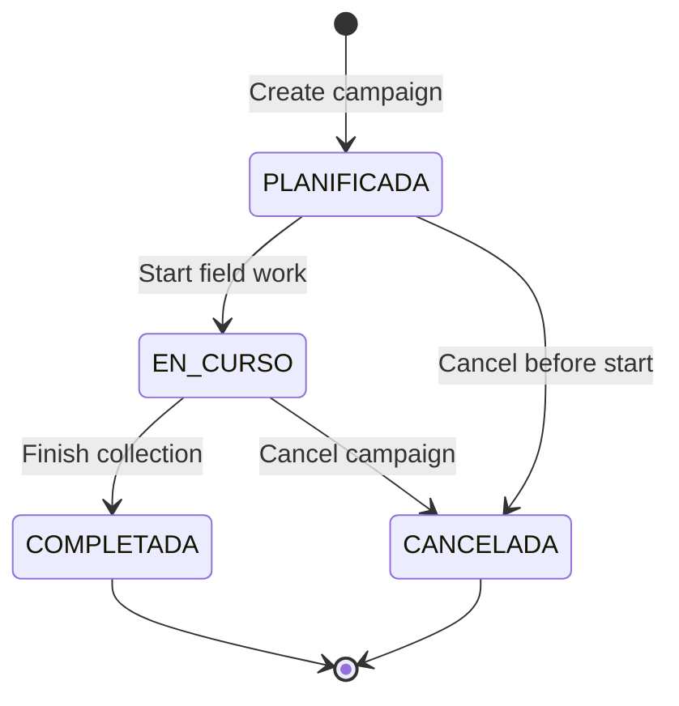

## Overview

Measurement campaigns in SMyEG enable systematic data collection across multiple domains (biological assets, dendrology, hydrology, demographics). Each campaign follows a specific measurement protocol and collects observations over time.

## Campaign Domains

Campaigns are organized by domain:

| Domain | Description | Example Protocols |
|--------|-------------|------------------|
| `BIOLOGICO` | Biological asset monitoring | Survival, Pre-harvest, Continuous monitoring |
| `DENDROMETRICO` | Forest mensuration | Multi-purpose plots, Carbon plots |
| `HIDROLOGICO` | Hydrological monitoring | Hydrological stations, Meteorological stations |
| `DEMOGRAFICO` | Social demographics | Community surveys, Household surveys |

## Measurement Protocols

### Biological Protocols

<AccordionGroup>
  <Accordion title="BIO_SOBREVIVENCIA - Survival Assessment" icon="seedling">
    Evaluates plantation survival rates after establishment.
    
    **Key Metrics**:
    - `SURVIVAL_REAL_PCT` - Actual survival percentage
    - `SURVIVAL_PRESC_PCT` - Survival vs. prescribed density
    - `DENSITY_VIVA_HA` - Live plants per hectare
    - `AVG_HEIGHT_RODAL` - Average height
    - `SAMPLING_ERROR_PCT` - Statistical sampling error
    
    **Decision Outputs**:
    - `SURVIVAL_SEMAFORO` - Traffic light indicator (VERDE/AMARILLO/ROJO)
    - `SURVIVAL_ACCEPTANCE_STATUS` - ACEPTADO / REQUIERE_REPLANTE
    - `OPERATIONAL_ACTION` - Recommended next action
  </Accordion>
  
  <Accordion title="BIO_PREOPERATIVO - Pre-operational" icon="clipboard-check">
    Validates establishment before harvest operations.
    
    **Key Metrics**:
    - `ESTABLISHMENT_COMPLIANCE_PCT` - Establishment vs. target
    - `FAILURE_RATE_PCT` - Failed plant percentage
    - `NET_DENSITY_HA` - Net established density
    - `READINESS_CLASS` - LISTO / AJUSTE_MENOR / REPROGRAMAR
  </Accordion>
  
  <Accordion title="BIO_PRECOSECHA - Pre-harvest" icon="tree">
    Assesses readiness for harvest operations.
    
    **Key Metrics**:
    - `HARVEST_READINESS_PCT` - Marked trees vs. harvestable
    - `ESTIMATED_VOLUME_M3_HA` - Volume per hectare
    - `QUALITY_ACCEPTABLE_PCT` - Quality acceptance rate
    - `HARVEST_CLASS` - LISTA_COSECHA / AJUSTE_PLAN / NO_APTA
  </Accordion>
  
  <Accordion title="BIO_CONTINUO - Continuous Monitoring" icon="chart-line">
    Ongoing stand health and growth monitoring.
    
    **Key Metrics**:
    - `LIVE_STOCK_DENSITY_HA` - Current live density
    - `MEAN_INCREMENT_M3_HA` - Volume increment
    - `MORTALITY_RATE_PCT` - Mortality rate
    - `HEALTH_ALERT_RATE_PCT` - Health incident rate
    - `CONTINUITY_STATUS` - ESTABLE / ALERTA_SANITARIA / RIESGO_MORTALIDAD
  </Accordion>
  
  <Accordion title="BIO_PARCELAS_PERMANENTES - Permanent Plots" icon="border-all">
    Long-term permanent sample plot monitoring.
    
    **Key Metrics**:
    - `TREE_DENSITY_HA` - Trees per hectare
    - `BASAL_AREA_HA` - Basal area (m²/ha)
    - `MEAN_DBH_CM` - Mean diameter at breast height
    - `STAND_STATUS` - OPTIMO / EN_DESARROLLO / DEGRADADO
  </Accordion>
</AccordionGroup>

### Dendrometric Protocols

<AccordionGroup>
  <Accordion title="DENDRO_PARCELA_MULTIPROPOSITO - Multi-purpose Plot" icon="ruler-combined">
    Comprehensive forest inventory measurements.
    
    **Key Metrics**:
    - `VOLUME_M3_HA` - Merchantable volume
    - `INCREMENT_M3_HA` - Current annual increment
    - `TREE_DENSITY_HA` - Tree density
    - `PRODUCTIVITY_CLASS` - ALTA / MEDIA / BAJA
  </Accordion>
  
  <Accordion title="DENDRO_PARCELA_CARBONO - Carbon Plot" icon="leaf">
    Carbon stock and sequestration measurement.
    
    **Key Metrics**:
    - `BIOMASS_T_HA` - Total biomass (tons/ha)
    - `CARBON_STOCK_T_HA` - Carbon stock (tons/ha)
    - `CO2_EQ_T_HA` - CO₂ equivalent (tons/ha)
    - `CARBON_CLASS` - ALTA_CAPTURA / CAPTURA_MEDIA / CAPTURA_BAJA
  </Accordion>
</AccordionGroup>

### Hydrological Protocols

<AccordionGroup>
  <Accordion title="HIDRO_ESTACION_HIDROLOGICA - Hydrological Station" icon="droplet">
    Water flow and level monitoring.
    
    **Key Metrics**:
    - `MEAN_FLOW_M3S` - Mean flow (m³/s)
    - `MAX_FLOW_M3S` - Maximum flow
    - `MEAN_WATER_LEVEL_M` - Mean water level
    - `FLOW_VARIABILITY_PCT` - Flow variability
    - `HYDRO_STATUS` - BAJO_RIESGO / RIESGO_MEDIO / RIESGO_ALTO
  </Accordion>
  
  <Accordion title="HIDRO_ESTACION_METEOROLOGICA - Weather Station" icon="cloud-sun">
    Meteorological data collection.
    
    **Key Metrics**:
    - `TOTAL_PRECIP_MM` - Total precipitation
    - `MEAN_AIR_TEMP_C` - Mean temperature
    - `MEAN_REL_HUMIDITY_PCT` - Mean humidity
    - `MAX_WIND_SPEED_MPS` - Maximum wind speed
    - `METEO_STATUS` - ESTABLE / ALERTA_MEDIA / ALERTA_ALTA
  </Accordion>
</AccordionGroup>

### Demographic Protocols

<AccordionGroup>
  <Accordion title="DEMO_ENCUESTA_COMUNIDAD - Community Survey" icon="users">
    Community-level demographic data.
    
    **Key Metrics**:
    - `COMMUNITY_POPULATION_TOTAL` - Total population
    - `MEAN_HOUSEHOLD_SIZE` - Average household size
    - `EMPLOYMENT_RATE_PCT` - Employment rate
    - `BASIC_SERVICES_COVERAGE_PCT` - Service coverage
    - `COMMUNITY_STATUS` - ESTABLE / EN_TRANSICION / VULNERABLE
  </Accordion>
  
  <Accordion title="DEMO_ENCUESTA_NUCLEO_FAMILIAR - Household Survey" icon="house-user">
    Household-level socioeconomic data.
    
    **Key Metrics**:
    - `HOUSEHOLD_MEAN_MEMBERS` - Mean household size
    - `HOUSEHOLD_MEAN_INCOME_USD` - Mean income
    - `FOOD_SECURITY_RATE_PCT` - Food security rate
    - `SCHOOL_ATTENDANCE_RATE_PCT` - School attendance
    - `HOUSEHOLD_STATUS` - RESILIENTE / INTERMEDIO / PRIORITARIO
  </Accordion>
</AccordionGroup>

## Creating Campaigns

### Via API

Create a measurement campaign using `POST /api/assets/measurement-campaigns`:

```typescript
const response = await fetch('/api/assets/measurement-campaigns', {
  method: 'POST',
  headers: { 'Content-Type': 'application/json' },
  body: JSON.stringify({
    level4Id: 'rodal-uuid',
    domain: 'BIOLOGICO',
    protocolType: 'BIO_SOBREVIVENCIA',
    campaignCode: 'SURV-2026-Q1-R001',
    campaignName: 'Q1 2026 Survival Assessment - Rodal 001',
    campaignDate: '2026-03-15T00:00:00Z',
    schemaVersion: '1.0',
    status: 'PLANIFICADA',
    notes: 'First quarter survival check',
    metadata: {
      expectedSamples: 30,
      technician: 'Juan Perez'
    }
  })
});
```

### Campaign Properties

From `src/app/api/assets/measurement-campaigns/route.ts:162-177`:

| Property | Type | Required | Description |
|----------|------|----------|-------------|
| `level4Id` | UUID | Yes | Forest patrimony level 4 (rodal) reference |
| `domain` | Enum | Yes | `BIOLOGICO`, `DENDROMETRICO`, `HIDROLOGICO`, `DEMOGRAFICO` |
| `protocolType` | Enum | Yes | Specific measurement protocol |
| `campaignCode` | String | Yes | Unique campaign identifier |
| `campaignName` | String | Yes | Descriptive campaign name |
| `campaignDate` | DateTime | Yes | Reference date for the campaign |
| `schemaVersion` | String | No | Data schema version (default: "1.0") |
| `status` | Enum | No | `PLANIFICADA`, `EN_CURSO`, `COMPLETADA`, `CANCELADA` |
| `notes` | String | No | Additional notes |
| `metadata` | JSON | No | Custom metadata |

### Organization Scoping

Campaigns are automatically scoped to the organization that owns the Level 4 unit:

```typescript
const level4 = await prisma.forestPatrimonyLevel4.findFirst({
  where: {
    id: parsed.data.level4Id,
    level3: { level2: { organizationId: organizationId ?? '' } }
  },
  select: {
    id: true,
    level3: { select: { level2: { select: { organizationId: true } } } }
  },
});

const ownerOrganizationId = level4.level3.level2.organizationId;
```

<Warning>
Users can only create campaigns for Level 4 units within their organization. The `organizationId` is enforced automatically.
</Warning>

## Adding Observations

### Creating Observations

Add measurement observations using `POST /api/assets/measurement-observations`:

```typescript
const observation = {
  campaignId: 'campaign-uuid',
  level5UnitCode: 'L5-PARCEL-01',
  sectionKey: 'SECTION-A',
  observedAt: '2026-03-15T10:30:00Z',
  payload: {
    // Protocol-specific payload (see below)
  }
};

await fetch('/api/assets/measurement-observations', {
  method: 'POST',
  headers: { 'Content-Type': 'application/json' },
  body: JSON.stringify(observation)
});
```

### Protocol-Specific Payloads

#### BIO_SOBREVIVENCIA Payload Example

From `src/app/api/assets/measurement-observations/route.ts:56-117`, survival observations require:

```json
{
  "lineId": 1,
  "sampleUnitId": 1,
  "spacingL1": 3.0,
  "spacingL2": 3.0,
  "liveNormal": 9,
  "liveAtipic": 1,
  "liveDrought": 0,
  "livePest": 0,
  "deadPest": 0,
  "deadDrought": 1,
  "deadMech": 0,
  "missingCount": 0,
  "avgHeight": 1.85
}
```

**Validation Rules**:

1. All counts must be non-negative integers or decimals (for spacing/height)
2. `lineId` and `sampleUnitId` must be positive integers
3. Spacing values must be positive
4. **Density check**: `(vivas + muertas + faltantes)` must equal `100 / (spacingL1 * spacingL2)` within ±1 tolerance

<Info>
The density check ensures data quality by verifying that evaluated points match the theoretical plant density for the 100m² sample unit.
</Info>

From `src/app/api/assets/measurement-observations/route.ts:107-115`:

```typescript
const liveTotal = liveNormal + liveAtipic + liveDrought + livePest;
const deadTotal = deadPest + deadDrought + deadMech;
const evaluatedPoints = liveTotal + deadTotal + missingCount;
const expectedPoints = 100 / (spacingL1 * spacingL2);

if (evaluatedPoints <= 0 || Math.abs(evaluatedPoints - expectedPoints) > 1) {
  return fail('Vivas + Muertas + Faltantes no coincide con la densidad teórica');
}
```

### Observation Properties

| Property | Type | Required | Description |
|----------|------|----------|-------------|
| `campaignId` | UUID | Yes | Parent campaign reference |
| `level5UnitCode` | String | No | Sample unit / plot identifier |
| `sectionKey` | String | No | Section or stratum identifier |
| `observedAt` | DateTime | No | Observation timestamp |
| `payload` | JSON | Yes | Protocol-specific measurement data |

## Data Collection Workflows

### Field Data Collection Process

<Steps>
  <Step title="Plan Campaign">
    Create a campaign with status `PLANIFICADA`, defining the protocol, date, and sample design.
  </Step>
  
  <Step title="Collect Field Data">
    Use mobile apps or field forms to collect observations. Each observation is linked to a specific sample unit (`level5UnitCode`) and section (`sectionKey`).
  </Step>
  
  <Step title="Submit Observations">
    POST observations to `/api/assets/measurement-observations`. The system validates payload structure based on the campaign's protocol.
  </Step>
  
  <Step title="Trigger Calculation">
    Observations are automatically queued for calculation via the asset measurement worker. Calculations generate summary metrics and quality indicators.
  </Step>
  
  <Step title="Review Results">
    Query calculated results from `/api/assets/result-snapshots` to view metrics, quality reports, and decision recommendations.
  </Step>
</Steps>

### Automatic Calculation Queue

When observations are added, a calculation job is automatically created:

From `src/lib/asset-measurement-worker.ts:11-32`:

```typescript
export async function enqueueAssetCalculationJob(params: {
  organizationId: string;
  campaignId: string;
  domain: AssetDomain;
  protocolType: MeasurementProtocolType;
  runAfter?: Date;
  createdById?: string | null;
}) {
  return prisma.assetCalculationJob.create({
    data: {
      organizationId: params.organizationId,
      campaignId: params.campaignId,
      domain: params.domain,
      protocolType: params.protocolType,
      status: AssetCalculationStatus.PENDING,
      runAfter: params.runAfter ?? new Date(),
      createdById: params.createdById ?? null,
    },
  });
}
```

## Querying Campaigns

### List Campaigns with Filters

```typescript
const params = new URLSearchParams({
  level4Id: 'rodal-uuid',
  domain: 'BIOLOGICO',
  protocolType: 'BIO_SOBREVIVENCIA',
  status: 'COMPLETADA',
  search: 'survival',
  page: '1',
  limit: '25',
  sortBy: 'campaignDate',
  sortOrder: 'desc'
});

const response = await fetch(`/api/assets/measurement-campaigns?${params}`);
const { items, pagination } = await response.json();
```

### Campaign Response Structure

```typescript
{
  items: [
    {
      id: string;
      organizationId: string;
      level4Id: string;
      domain: 'BIOLOGICO' | 'DENDROMETRICO' | 'HIDROLOGICO' | 'DEMOGRAFICO';
      protocolType: MeasurementProtocolType;
      campaignCode: string;
      campaignName: string;
      campaignDate: Date;
      status: 'PLANIFICADA' | 'EN_CURSO' | 'COMPLETADA' | 'CANCELADA';
      level4: {
        id: string;
        code: string;
        name: string;
      };
      _count: {
        observations: number;
        results: number;
        calculationJobs: number;
      };
      createdAt: Date;
    }
  ],
  pagination: {
    total: number;
    page: number;
    limit: number;
    totalPages: number;
  }
}
```

## Querying Observations

### List Observations

```typescript
const params = new URLSearchParams({
  campaignId: 'campaign-uuid',
  level5UnitCode: 'L5-PARCEL-01',
  sectionKey: 'SECTION-A',
  search: 'parcel',
  page: '1',
  limit: '25'
});

const response = await fetch(`/api/assets/measurement-observations?${params}`);
const { items, pagination } = await response.json();
```

## Campaign Status Management

### Update Campaign Status

```typescript
await fetch(`/api/assets/measurement-campaigns`, {
  method: 'PATCH',
  headers: { 'Content-Type': 'application/json' },
  body: JSON.stringify({
    id: 'campaign-uuid',
    status: 'COMPLETADA',
    notes: 'All field measurements completed and validated'
  })
});
```

### Status Workflow



## Deleting Campaigns and Observations

### Delete Campaign

```typescript
await fetch('/api/assets/measurement-campaigns', {
  method: 'DELETE',
  headers: { 'Content-Type': 'application/json' },
  body: JSON.stringify({ id: 'campaign-uuid' })
});
```

<Warning>
Campaigns can only be deleted if they have no associated observations or results. This prevents accidental data loss.
</Warning>

From `src/app/api/assets/measurement-campaigns/route.ts:302-304`:

```typescript
if (campaign._count.observations > 0 || campaign._count.results > 0) {
  return fail('La campaña tiene observaciones o resultados asociados', 409);
}
```

## Permission Requirements

| Operation | Permission |
|-----------|------------|
| List campaigns | `asset-measurement:READ` |
| Create campaign | `asset-measurement:CREATE` |
| Update campaign | `asset-measurement:UPDATE` |
| Delete campaign | `asset-measurement:DELETE` |
| List observations | `asset-measurement:READ` |
| Create observation | `asset-measurement:CREATE` |
| Update observation | `asset-measurement:UPDATE` |
| Delete observation | `asset-measurement:DELETE` |

## Best Practices

<CardGroup cols={2}>
  <Card title="Consistent Campaign Codes" icon="barcode">
    Use a standardized naming convention like `PROTOCOL-YEAR-QUARTER-RODAL`.
  </Card>
  <Card title="Validate Before Submit" icon="clipboard-check">
    Validate observation payloads locally before submission to avoid processing errors.
  </Card>
  <Card title="Group by Section" icon="layer-group">
    Use `sectionKey` to organize observations by stratum or management unit.
  </Card>
  <Card title="Monitor Job Status" icon="clock-rotate-left">
    Check calculation job status to ensure metrics are computed successfully.
  </Card>
</CardGroup>

## Related Files

- Campaign API: `src/app/api/assets/measurement-campaigns/route.ts`
- Observation API: `src/app/api/assets/measurement-observations/route.ts`
- Asset worker: `src/lib/asset-measurement-worker.ts`
- Worker scheduler: `src/workers/asset-measurement-worker-scheduler.ts`