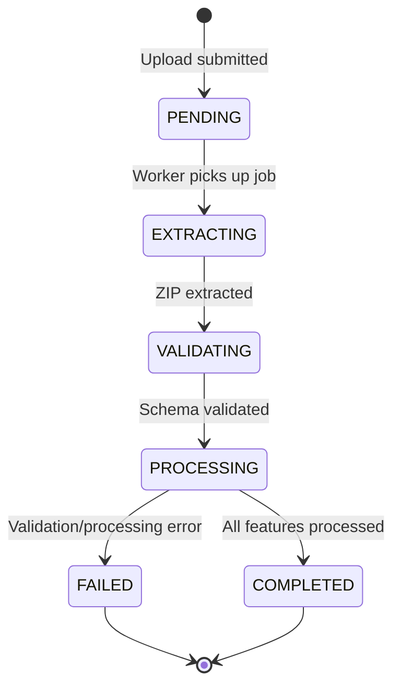

## Overview

SMyEG supports importing Level 4 (Rodal) geometries via shapefile uploads. The system processes shapefiles asynchronously using a dedicated geo worker, validates geometries, and updates the forest patrimony database.

## Required Attributes

### Hierarchical Identifiers

Every feature in your shapefile **must** contain these three attributes for proper hierarchy linking:

| Attribute | Required | Description | Example |
|-----------|----------|-------------|----------|
| `nivel2_id` | Yes | Level 2 identifier (Finca) | `FINCA-01` |
| `nivel3_id` | Yes | Level 3 identifier (Lote) | `LOTE-01` |
| `nivel4_id` | Yes | Level 4 identifier (Rodal) | `RODAL-001` |

<Warning>
The combination of `nivel2_id + nivel3_id + nivel4_id` must correspond to an existing hierarchy in your organization's database. Imports will fail if the relationship doesn't exist.
</Warning>

### Alternative Field Names

The system recognizes multiple field name variations. From `src/lib/geo-import-worker.ts:36-39`:

```typescript
const DEFAULT_FIELD_MAP = {
  level2: ['nivel2', 'nivel_2', 'cod_n2', 'codfinca', 'finca', 'nivel2_id', 'n2'],
  level3: ['nivel3', 'nivel_3', 'cod_n3', 'codlote', 'lote', 'nivel3_id', 'n3'],
  level4: ['nivel4', 'nivel_4', 'cod_n4', 'codrodal', 'rodal', 'nivel4_id', 'n4'],
  // ...
};
```

<Tip>
You can use any of the recognized field names. For example, `nivel2_id`, `nivel2`, `finca`, or `cod_n2` all work for Level 2.
</Tip>

### Optional Attributes

| Field | Optional | Format | Description |
|-------|----------|--------|-------------|
| `currentLandUseName` | Recommended | Text | Current land use classification |
| `previousLandUseName` | Optional | Text | Previous land use (for variation tracking) |
| `variationDate` | Optional | `YYYY-MM-DD` | Date of land use change |
| `variationNotes` | Optional | Text | Notes about the variation |

### Field Name Recognition for Optional Fields

From `src/lib/geo-import-worker.ts:40-43`:

```typescript
currentLandUseName: [
  'currentlandusename', 'usoactual', 'uso_actual',
  'uso', 'landuse', 'land_use', 'usosueloactual'
],
previousLandUseName: [
  'previouslandusename', 'usoanterior', 'uso_anterior',
  'previoususe', 'oldlanduse', 'usosueloanterior'
],
```

## File Format Requirements

### ZIP Archive Contents

Your shapefile upload **must** be a ZIP archive containing these mandatory files:

<AccordionGroup>
  <Accordion title="Required Files" icon="file-zipper">
    - `.shp` - Shape format (geometry)
    - `.shx` - Shape index
    - `.dbf` - Attribute data
    - `.prj` - Coordinate system definition
  </Accordion>
  <Accordion title="Optional Files" icon="file">
    - `.cpg` - Character encoding
    - `.sbn`/`.sbx` - Spatial index
    - `.xml` - Metadata
  </Accordion>
</AccordionGroup>

### Validation Check

From `src/lib/geo-import-worker.ts:250-259`:

```typescript
const zip = await JSZip.loadAsync(zipBuffer);
const fileNames = Object.keys(zip.files).map((name) => name.toLowerCase());

const requiredExtensions = ['.shp', '.shx', '.dbf', '.prj'];
const missing = requiredExtensions.filter(
  (ext) => !fileNames.some((name) => name.endsWith(ext))
);

if (missing.length > 0) {
  throw new Error(`Archivo ZIP inválido. Faltan: ${missing.join(', ')}`);
}
```

## Spatial Requirements

### Geometry Type

<Steps>
  <Step title="Supported Types">
    Only `Polygon` and `MultiPolygon` geometries are accepted.
  </Step>
  <Step title="Automatic Conversion">
    `Polygon` geometries are automatically converted to `MultiPolygon` for consistency.
  </Step>
  <Step title="Invalid Geometries">
    Features with point, line, or null geometries will be rejected.
  </Step>
</Steps>

### Coordinate Reference System (CRS)

- **Input**: Any valid CRS defined in the `.prj` file
- **Output**: All geometries are transformed to **EPSG:4326** (WGS 84)
- **Requirement**: The `.prj` file must be readable and the CRS transformable

### Geometry Normalization

From `src/lib/geo-import-worker.ts:115-133`:

```typescript
function normalizeGeometry(
  geometry: GeoFeature['geometry']
): { type: 'MultiPolygon'; coordinates: unknown } | null {
  if (!geometry) return null;

  if (geometry.type === 'Polygon') {
    return {
      type: 'MultiPolygon',
      coordinates: [geometry.coordinates],
    };
  }

  if (geometry.type === 'MultiPolygon') {
    return {
      type: 'MultiPolygon',
      coordinates: geometry.coordinates,
    };
  }

  return null;
}
```

## Upload Process

### Step 1: Prepare Your ZIP File

<CodeGroup>
```csv template.csv
nivel2_id,nivel3_id,nivel4_id,nombre_rodal,fuente,fecha_levantamiento,observacion
FINCA-01,LOTE-01,RODAL-001,Rodal Norte,Levantamiento GPS,2026-03-01,Sin novedad
FINCA-01,LOTE-01,RODAL-002,Rodal Sur,Levantamiento GPS,2026-03-01,Sin novedad
```

```bash shell
# Package your shapefile
zip nivel4_import.zip \
  parcelas.shp \
  parcelas.shx \
  parcelas.dbf \
  parcelas.prj
```
</CodeGroup>

### Step 2: Submit Upload

From the README checklist:

<Checklist>
  - [ ] `nivel2_id`, `nivel3_id`, `nivel4_id` complete in all records
  - [ ] No duplicates of `nivel2_id + nivel3_id + nivel4_id` within the batch
  - [ ] ZIP includes `.shp`, `.shx`, `.dbf`, `.prj`
  - [ ] `.prj` is correct and CRS transformable to EPSG:4326
  - [ ] Geometries are valid and polygon type
</Checklist>

### Step 3: Upload via API

From `src/app/api/forest/geo/import/route.ts:111-213`:

```typescript
const formData = new FormData();
formData.append('file', zipFile);
formData.append('variationDate', '2026-03-15');
formData.append('variationNotes', 'Annual boundary update');

const response = await fetch('/api/forest/geo/import', {
  method: 'POST',
  body: formData
});

const { jobId, status, message } = await response.json();
// Returns HTTP 202 Accepted
```

<Info>
Uploads return immediately with status `202 Accepted`. Processing happens asynchronously via the geo worker.
</Info>

## Import Workflow

### Job Lifecycle



### Processing Steps

From `src/lib/geo-import-worker.ts:232-547`:

<Steps>
  <Step title="EXTRACTING">
    Extract ZIP contents and validate required files (.shp, .shx, .dbf, .prj)
  </Step>
  <Step title="VALIDATING">
    Parse shapefile using `shpjs` library and validate geometry types
  </Step>
  <Step title="PROCESSING">
    For each feature:
    - Extract hierarchy codes
    - Validate against existing database records
    - Transform geometry to EPSG:4326
    - Check land use type validity
    - Store geometry with bitemporal validity
    - Calculate area and centroid
    - Create land use variation records if applicable
  </Step>
  <Step title="COMPLETED/FAILED">
    Update job status and record processed/failed counts
  </Step>
</Steps>

### Database Storage

Geometries are stored with bitemporal tracking:

```sql
INSERT INTO public.forest_geometry_n4 (
  id,
  organization_id,
  level2_id,
  level3_id,
  level4_id,
  geom,
  import_job_id,
  is_active,
  valid_from,
  created_at,
  updated_at
) VALUES (
  gen_random_uuid(),
  ${organizationId}::uuid,
  ${level2Id}::uuid,
  ${level3Id}::uuid,
  ${level4Id}::uuid,
  ST_SetSRID(ST_Multi(ST_GeomFromGeoJSON(${geometryJson})), 4326),
  ${jobId}::uuid,
  TRUE,
  NOW(),
  NOW(),
  NOW()
)
```

## Monitoring Import Jobs

### Check Job Status

```typescript
const response = await fetch(`/api/forest/geo/import/${jobId}`);
const job = await response.json();

console.log({
  status: job.status,
  totalRecords: job.totalRecords,
  processedRecords: job.processedRecords,
  failedRecords: job.failedRecords,
  errorMessage: job.errorMessage
});
```

### Job Status Values

- `PENDING` - Queued for processing
- `EXTRACTING` - Extracting ZIP contents  
- `VALIDATING` - Validating shapefile structure
- `PROCESSING` - Importing features
- `COMPLETED` - Successfully completed
- `FAILED` - Import failed (see `errorMessage`)

### View Import Details

Each feature's processing result is logged:

```typescript
const items = await fetch(`/api/forest/geo/import/${jobId}/items`);
// Returns array of GeoImportJobItem records

items.forEach(item => {
  console.log({
    featureIndex: item.featureIndex,
    status: item.status, // PROCESSED or FAILED
    level2Code: item.level2Code,
    level3Code: item.level3Code,
    level4Code: item.level4Code,
    message: item.message,
    rawProperties: item.rawProperties
  });
});
```

## Land Use Variation Tracking

### Automatic Variation Creation

When importing shapefiles with land use changes, the system automatically creates variation records:

From `src/lib/geo-import-worker.ts:428-487`:

```typescript
const currentBefore = level4.currentLandUseName;
const currentAfter = validatedCurrentLandUse ?? currentBefore;
const previousForVariation = validatedPreviousLandUse ?? currentBefore;

const didLandUseChange = Boolean(
  currentAfter &&
  normalizeTextCompare(currentAfter) !== normalizeTextCompare(currentBefore)
);

if (didLandUseChange) {
  await tx.landPatrimonialVariation.create({
    data: {
      organizationId: job.organizationId,
      level4Id: level4.id,
      previousLandUseName: previousForVariation,
      newLandUseName: currentAfter,
      affectedAreaHa: computedArea,
      variationDate: resolvedVariationDate,
      notes: resolvedVariationNotes,
      kind: 'INCREMENTO',
      status: 'PENDIENTE',
      createdById: job.createdById,
    },
  });
}
```

## Troubleshooting

### Common Import Errors

<AccordionGroup>
  <Accordion title="Missing hierarchy codes" icon="triangle-exclamation">
    **Error**: "No se encontraron códigos de jerarquía Nivel2/Nivel3/Nivel4"
    
    **Solution**: Ensure every feature has `nivel2_id`, `nivel3_id`, and `nivel4_id` attributes with non-empty values.
  </Accordion>
  
  <Accordion title="Invalid geometry type" icon="shapes">
    **Error**: "Solo se permiten geometrías Polygon o MultiPolygon"
    
    **Solution**: Check your shapefile contains only polygon geometries. Points and lines are not supported.
  </Accordion>
  
  <Accordion title="Hierarchy not found" icon="sitemap">
    **Error**: "No existe relación jerárquica válida para Nivel 2/3/4 en la organización"
    
    **Solution**: Create the Level 2/3/4 hierarchy in the database before importing geometries. The codes must match exactly.
  </Accordion>
  
  <Accordion title="Missing required files" icon="file-circle-xmark">
    **Error**: "Archivo ZIP inválido. Faltan: .prj, .dbf"
    
    **Solution**: Ensure your ZIP contains all four required files: `.shp`, `.shx`, `.dbf`, `.prj`
  </Accordion>
  
  <Accordion title="Invalid land use type" icon="tree">
    **Error**: "El uso actual no existe en la tabla auxiliar de Uso de Suelos"
    
    **Solution**: The land use name must match an existing `LandUseType` record in your organization (case-insensitive). Create the land use type first, or omit the field.
  </Accordion>
</AccordionGroup>

### Validation Before Upload

Use QGIS or similar tools to validate your shapefile:

```python
# Example QGIS Python console check
layer = iface.activeLayer()

required_fields = ['nivel2_id', 'nivel3_id', 'nivel4_id']
for field in required_fields:
    if field not in [f.name() for f in layer.fields()]:
        print(f"Missing required field: {field}")

for feature in layer.getFeatures():
    geom = feature.geometry()
    if geom.type() != QgsWkbTypes.PolygonGeometry:
        print(f"Feature {feature.id()} is not a polygon")
```

## Organization Security

<Warning>
The `organization_id` is **never** taken from shapefile attributes. It is always resolved from the authenticated user's organization.
</Warning>

From the README:

> organization_id no se toma del shapefile; se resuelve desde el usuario autenticado.
> Toda carga/vinculación fuera de la organización del usuario es rechazada.

This prevents users from importing data into other organizations.

## Best Practices

<CardGroup cols={2}>
  <Card title="Validate Locally First" icon="magnifying-glass-chart">
    Use QGIS or ArcGIS to validate geometry and attributes before uploading.
  </Card>
  <Card title="Use Consistent Naming" icon="tags">
    Standardize your attribute field names across all shapefiles for easier processing.
  </Card>
  <Card title="Batch by Organization" icon="layer-group">
    Import one organization's data at a time to avoid hierarchy mismatches.
  </Card>
  <Card title="Monitor Job Status" icon="chart-line">
    Check import job status regularly and review failed feature details.
  </Card>
</CardGroup>

## Related Files

- Geo import worker: `src/lib/geo-import-worker.ts`
- Geo worker scheduler: `src/workers/geo-worker-scheduler.ts`
- Import API endpoint: `src/app/api/forest/geo/import/route.ts`
- Worker trigger endpoint: `src/app/api/forest/geo/import/worker/route.ts`